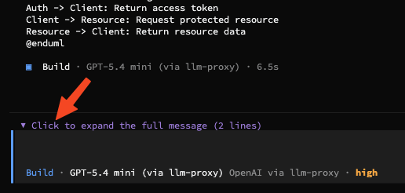
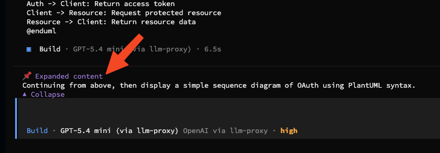
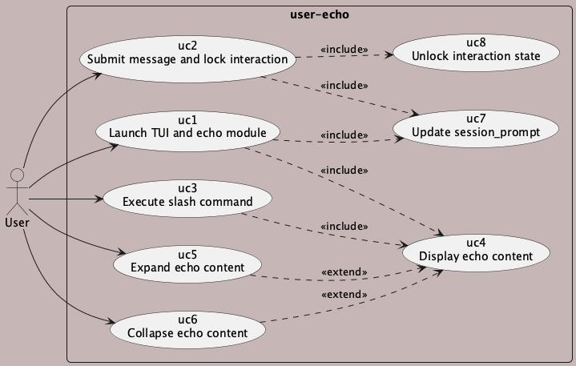
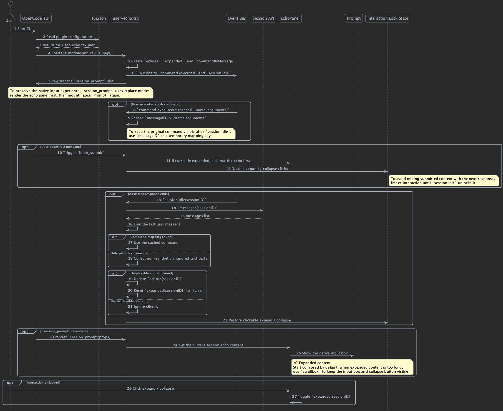

# user-echo

OpenCode TUI plugin that echoes the latest user message above the prompt.

It keeps the native input box, adds a collapsible echo panel, and makes the latest conversation visible right above the input area.

[中文說明](README_zhtw.md)

## What Is user-echo?

user-echo is a lightweight OpenCode TUI plugin for keeping the latest AI and user exchange visible in-place, so when you leave the TUI and come back, you do not need to scroll up to remember what was just asked.

## Quick Start

1. Copy `src/user-echo.tsx` to `.opencode/plugins/user-echo.tsx`.
2. Register the plugin in `.opencode/tui.json`.
3. Restart OpenCode TUI.

```json
{
  "$schema": "https://opencode.ai/tui.json",
  "plugin": ["./.opencode/plugins/user-echo.tsx"]
}
```

## Why This Plugin

- Keeps the latest conversation visible above the input area.
- Reduces the need to scroll up after returning to the TUI.
- Makes the last user and AI exchange easy to recall at a glance.
- Preserves slash commands as plain text.
- Stays display-only, so it does not mutate session content.

### Collapsed



### Expanded



## How It Works

- Captures slash commands from `command.executed`.
- Reads the latest user message on `session.idle`.
- Renders a collapsible echo panel in `session_prompt`.
- Locks expand and collapse while a message is being submitted.
- Uses `scrollbox` for long content.
- Stays display-only: no message creation and no context export.

### Use Case



### Sequence



## Repository Layout

- `src/user-echo.tsx` is the plugin entry.
- `docs/en/` contains the English design docs.
- `docs/zh-TW/` contains the Traditional Chinese design docs.
- `docs/images/` contains direct-render PNG UI examples.

## Source Docs

- `docs/en/README.md`
- `docs/zh-TW/README.md`
- `docs/en/uc_user-echo_main.puml`
- `docs/en/sd_user-echo.puml`
- `docs/zh-TW/uc_user-echo_main.puml`
- `docs/zh-TW/sd_user-echo.puml`
- `docs/images/example-01.png`
- `docs/images/example-02.png`

## FAQ

- Does it change the message stream? No. It only renders UI.
- Does it work with long messages? Yes. Long content uses `scrollbox`.

## Customize It

- This repo is MIT licensed.
- If you want to change behavior or styling, fork this repo and edit `src/user-echo.tsx`.

## License

- MIT
