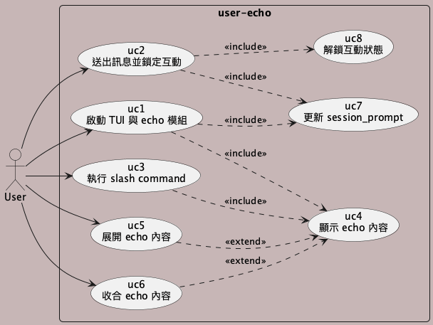
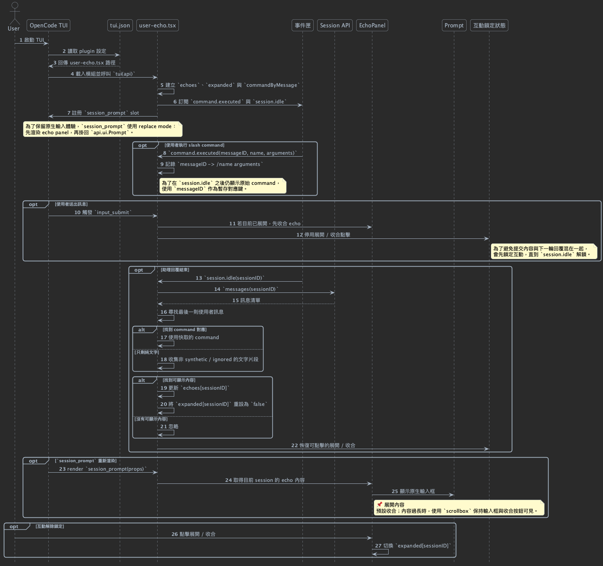

# user-echo

OpenCode TUI plugin，會在輸入框上方顯示最新使用者訊息。

它保留原生輸入框，加入可展開與收合的 echo 區塊，讓最新對話直接顯示在 input area 上方。

[English version](README.md)

## 什麼是 user-echo？

user-echo 是一個輕量的 OpenCode TUI plugin，用來把最新的 AI 與使用者對話直接留在畫面上，讓你離開 TUI 再回來時，不需要再往上捲去回憶剛剛問了什麼。

## 快速開始

1. 將 `src/user-echo.tsx` 複製到 `.opencode/plugins/user-echo.tsx`。
2. 在 `.opencode/tui.json` 註冊這個 plugin。
3. 重新啟動 OpenCode TUI。

```json
{
  "$schema": "https://opencode.ai/tui.json",
  "plugin": ["./.opencode/plugins/user-echo.tsx"]
}
```

## 為什麼需要它

- 讓最新對話一直顯示在 input area 上方。
- 減少回到 TUI 後還要往上捲找對話內容的麻煩。
- 讓剛剛的使用者與 AI 互動可以一眼回想起來。
- 將 slash command 保持為可讀文字。
- 只做畫面顯示，不會改動 session 內容。

### 收合狀態


### 展開狀態


## 運作方式

- 透過 `command.executed` 記錄 slash command。
- 在 `session.idle` 時讀取最新的使用者訊息。
- 於 `session_prompt` 內渲染可收合的 echo 面板。
- 在訊息送出期間鎖定展開與收合操作。
- 長內容會使用 `scrollbox`。
- 只做畫面顯示，不會建立新訊息，也不會輸出 context。

### 使用案例圖



### 循序圖



## 專案結構

- `src/user-echo.tsx` 是 plugin 入口。
- `docs/en/` 放英文設計文件。
- `docs/zh-TW/` 放繁體中文設計文件。
- `docs/images/` 放可直接預覽的 UI 範例。

## 文件來源

- `docs/en/README.md`
- `docs/zh-TW/README.md`
- `docs/en/uc_user-echo_main.puml`
- `docs/en/sd_user-echo.puml`
- `docs/zh-TW/uc_user-echo_main.puml`
- `docs/zh-TW/sd_user-echo.puml`
- `docs/images/example-01.png`
- `docs/images/example-02.png`

## FAQ

- 會改變訊息流嗎？不會，只負責 UI 呈現。
- 長訊息可以顯示嗎？可以，超長內容會使用 `scrollbox`。

## 自訂方式

- 這個 repo 使用 MIT 授權。
- 如果要調整行為或樣式，建議直接 fork 之後修改 `src/user-echo.tsx`。

## 授權

- MIT
